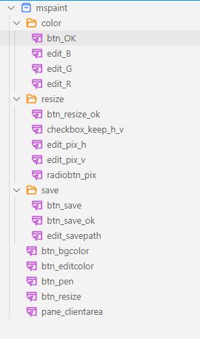
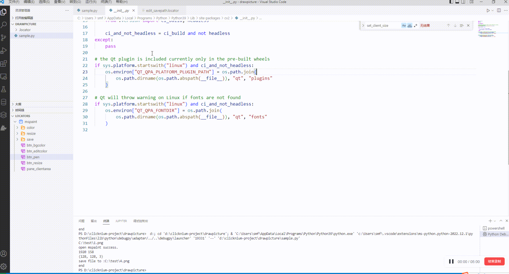

## Use python automation to draw a pixel style logo

Use the python automation library **[clicknium](https://www.clicknium.com/documents)**  to automatically operate the mouse and keyboard to draw the pixel style logo. The library provides complete automation functions, supports desktop software, web pages, Java applications, SAP applications, and even image recognition, and is very intuitive and convenient to use. As long as you can use python, there is no obstacle to using clicknium. For details, you can refer to the official documents. Use Python automation to implement an interesting drawing process.

### Steps:
1. Environment preparation: system > win7, vscode, Python

2. Install clicknium vscode extension

3. pip install clicknium

4. pip install opencv-python

5. in vscode,press Ctrl + Shift + P, select clicknium: Sample, select the directory, create the sample project, and delete the code in main function

6. Record the controls needed in the process, and write the Python code of the automation process

7. Press F5 to run sample.py file

### Record Elements
Use Ctrl + F10 to start the recorder. The elements required for program are as follows (classify and rename them for easy reading and manager):




### program struct
```python
# open and init mspaint
open_mspaint()
set_client_size()
set_backgroun_color()
...
# translate image to a binarization image by python module opencv
binarization(sourceImgPath,binarizationSavePath)
...

# get start position of mspaint client area
rect = ui(locator.mspaint.pane_clientarea).get_property('BoundingRectangle')
lsRect = rect.split('{')[1].partition('}')[0].split(',')
clientRectX = int(lsRect[0].split('=')[1])
clientRectY = int(lsRect[1].split('=')[1])
...
# read image and get RGB of each point
img = read_picture(binarizationSavePath)
...
# control the mouse and draw on mspaint
draw(dict_x_y,dict_y_x)
```

### Get the source code
[mspaint-draw-img](https://github.com/automation9417/mspaint-draw-img)

#### Result


